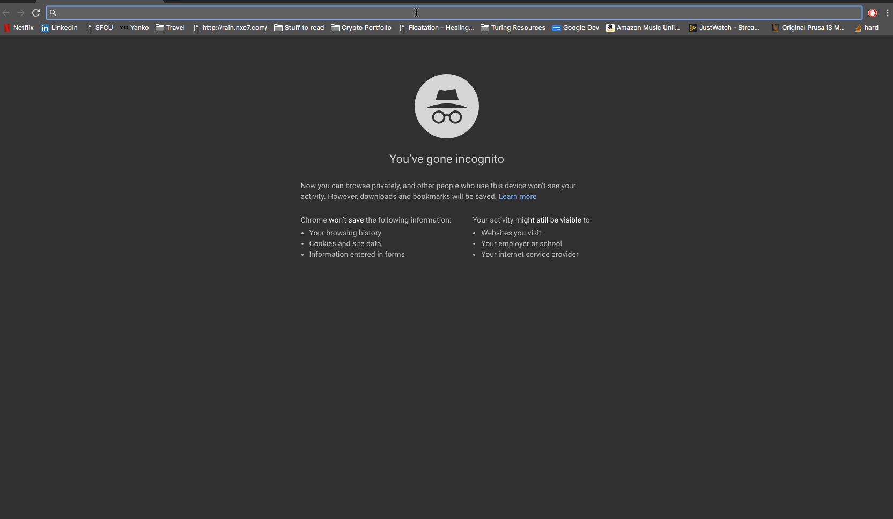

# [Adventure Day](https://adventure-day.herokuapp.com/)

Adventure Day will provide a randomly generated walking route to a user, for adventuring! It was created with two relatively simple goals in mind: to get people walking more, and to explore places one might otherwise not encounter.

## Using the application

This app was decide with ease of use in mind, and as such has a few barriers to entry as possible. A user simply needs to visit the [site](https://adventure-day.herokuapp.com/). Adventure day works as follows:
- A route from 4 inputs
  - Origin
    - The form auto-populates with user's geolocation if permission is given
    - User may enter an address or location name into the form
  - Kind of location the user is interested in(Restaurant, Park, Museum, etc.)
  - A search radius around the origin in which to search for places
  - A randomized route button OR an optimized route button




Once a user selects a route they will be taken to a Google Maps page or, if the user is on a mobile device, a Google Maps App. After that all one has to do is press 'Start' in the app and they will be off!
<div style="text-align: center;">

</div>
## Setup for cloning and working in this project (Mac)

You will need to have access to a text editor, I use [Atom](https://flight-manual.atom.io/getting-started/sections/installing-atom/). You will also need [Python](https://wiki.python.org/moin/BeginnersGuide) and [Django](https://www.djangoproject.com/start/). I recommend using a software package management system, such as [Homebrew](https://docs.brew.sh/Installation) (*This is the one I use*).

Open a terminal window. Your computer comes with a terminal installed, but there are numerous 3rd party options with additional features. I use [iTerm](https://www.iterm2.com/downloads.html) but there are a number of excellent options.

Now that you have a window open and enter the following command to install Homebrew
```
mkdir homebrew && curl -L https://github.com/Homebrew/brew/tarball/master | tar xz --strip 1 -C homebrew
```
Once the installation completes enter the command
```
brew install python3
```
Now that you have Python v3 installed, you can [fork and clone](https://help.github.com/articles/fork-a-repo/) this repository
```
git clone git@github.com:YOUR_USER_NAME_HERE/adventure-day.git
```
Change directories into the repo, and create a virtual environment
```
python3 -m venv .env
```
Next, you'll want to install the required packages for the project
```
pip3 install -r requirements.txt
```
Pip (Pip installs packages) was installed with Python3 via Homebrew, it is to Python what Homebrew is to your OS.

While this project does not currently utilize a database, it does have one set up in anticipation of coming features. If you don't already have PostgreSQL (also called Postgres) installed run the following commands to install it and create the db
```
brew install postgresql
```
```
psql
```
This takes you into the PostgreSQL interactive terminal. Some commands to note:
  - ``control + \`` is the best way to exit the psql environment
  - Some returns will keep showing more data on most keystrokes, hit ``q`` to get out
  - Semicolons are import in here, if you're having issues with some commands make sure to end with ``;``

While in the psql environment enter
```
CREATE DATABASE adventure_day;
```

This app also requires the use of two keys you'll want to keep secret, the project comes with python-decouple included. Create file named ``.env``, copy into it the contents from ``TEMP.env``, this is where you'll place your Django and Google Maps API keys.

#### Django Secret Key
You can generate a key [here](https://www.miniwebtool.com/django-secret-key-generator/).
Replace YOUR_KEY_HERE in line 1 of ``.env`` leave this open, you'll need it again in a few minutes.

#### Google Maps Platform Key
You'll now need to acquire a Google Maps API key. Follow the instructions on [Google Developer](https://developers.google.com/maps/documentation/javascript/get-api-key). **Please Note:** This does require a credit card, you'll receive $300 credit for API calls/month from Google, but I recommend you familiarize yourself with billing agreement, free plan, and respective API charges. (After ~300 calls to 5 services each, and 2000+ to Distance matrix the total charges were $25. Covered by the credit, of course)

Once you have a Google API key add it to ``.env`` en lieu of YOUR_SECRET_HERE on line 2. Your secrets are now hidden in the ignored ``.env`` file.

Run the command
```
python3 manage.py runserver

```

Now that you have the server running in your terminal, head to your browser and navigate to [localhost:8000](<http://localhost:8000>).

You're all set! If you encountered any setup errors let me know in the comments. (Issues coming soon)

## Additional Resources

- [dj-database-url](https://pypi.org/project/dj-database-url/)
- [django-cors-headers](https://pypi.org/project/django-cors-headers/)
- [Django REST framework](http://www.django-rest-framework.org/)
- [Gunicorn](http://docs.gunicorn.org/en/stable/)
- [Psycopg2](http://initd.org/psycopg/docs/)
- [Virtualenv](https://virtualenv.pypa.io/en/stable/)
- [WhiteNoise](http://whitenoise.evans.io/en/stable/)
- [django-bootstrap3](https://django-bootstrap3.readthedocs.io/en/latest/)
- [Python Decouple](https://github.com/henriquebastos/python-decouple/blob/master/README.rst)
- [Requests](http://docs.python-requests.org/en/master/)
- [googlemaps](https://github.com/googlemaps/google-maps-services-python)
- [Google OR-Tools](https://developers.google.com/optimization/introduction/installing/binary)
